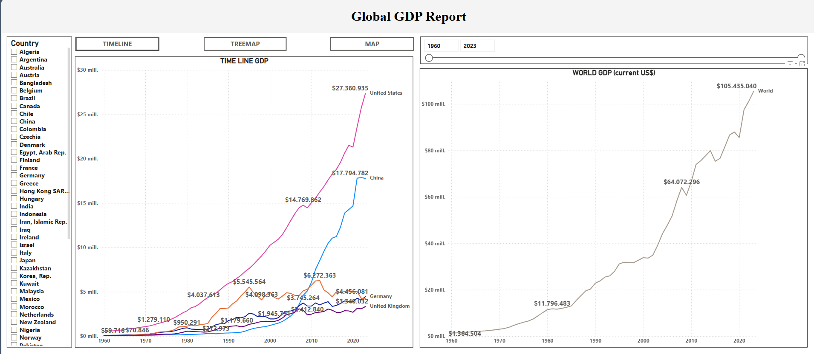

# A Python project to analyze global GDP with the World Bank API.

## Table of Contents
- [Report](#Report)
- [Requirements](#requirements)
- [Project Overview](#project-overview)
- [Steps](#steps)
- [Power BI Integration](#power-bi-integration)

# Report
This project provides a foundational approach to gathering, formatting, and preparing GDP data for analysis. Feel free to adapt or expand the code for specific analytical needs.

[GDP Report](https://app.powerbi.com/view?r=eyJrIjoiZmUwZGE3ZGMtM2Q3OC00OGE4LTgzMDktN2ExMjQ2ZGU2ZTkwIiwidCI6IjZmZDQ4ZjQxLWFmODEtNDVhNS05YzFlLWUzOTkwYmMyN2U3YyIsImMiOjR9)

[](https://app.powerbi.com/view?r=eyJrIjoiZmUwZGE3ZGMtM2Q3OC00OGE4LTgzMDktN2ExMjQ2ZGU2ZTkwIiwidCI6IjZmZDQ4ZjQxLWFmODEtNDVhNS05YzFlLWUzOTkwYmMyN2U3YyIsImMiOjR9)

## Requirements
To run this, you will need:
- Python 3.x
- [pandas](https://pandas.pydata.org/)
- [wbgapi](https://pypi.org/project/wbgapi/)

Install the required packages using:
```bash
pip install pandas wbgapi
```


## Steps

### 1. Define Indicator and Country
The World Bank GDP indicator code **"NY.GDP.MKTP.CD"** is used to specify the desired data in current US dollars. We set **"country = 'all"** to include all available countries and define a **"time"** variable containing the range of years (1960 to 2023) for the analysis.

```python
indicator = 'NY.GDP.MKTP.CD'  # GDP in current US dollars
country = 'all'                # All countries
time = list(range(1960, 2024)) # Range of dates from 1960 to 2023
```

### 2. Retrieve Data from World Bank API
To avoid overloading the API, we download data year by year using a loop. Each year’s data is appended to a master DataFrame **"gdp_data"**. 

```python
gdp_data = pd.DataFrame()

# Download data year by year to avoid API download issues
for year in time:
    yearly_data = wb.data.DataFrame(indicator, country, year, labels=True)
    yearly_data['year'] = year
    gdp_data = pd.concat([gdp_data, yearly_data])
```

### 3. Ensure Numeric GDP Values
The GDP data column is converted to numeric format to handle any missing or invalid data. The **"pd.to_numeric()"** function converts all values to numeric types, setting non-numeric entries to NaN.

```python
gdp_data['NY.GDP.MKTP.CD'] = pd.to_numeric(gdp_data['NY.GDP.MKTP.CD'], errors='coerce')
```

### 4. Format GDP Data for Readability
The GDP values are formatted with thousands separators and a decimal point. This is achieved using a lambda function that applies formatting if the value is not null.

```python
gdp_data['NY.GDP.MKTP.CD'] = gdp_data['NY.GDP.MKTP.CD'].apply(lambda x: '{:,.2f}'.format(x).replace(',', '.') if pd.notnull(x) else x)
```

### 5. Display Data
Finally, the project displays the processed GDP data in an easy-to-read format, showing GDP in current US dollars by country and year.

```python
print(gdp_data)
```

## Power BI Integration
To use this data in Power BI, follow these steps:
1. Open Power BI Desktop.
2. Go to **"Get Data"** and select **"More..."**.
3. In the search bar, look for **"Python script"** and select it.
4. Copy and paste the Python script from this project to retrieve and format the GDP data.
5. Click **"OK"** to run the script, and Power BI will load the data, making it ready for creating visuals and reports.

This integration enables you to leverage Power BI’s visualization tools to analyze GDP trends over time by country, enhancing your ability to report and interpret economic data.
